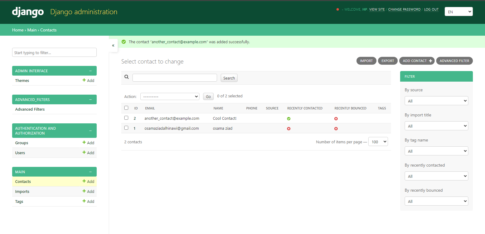

<!-- Improved compatibility of back to top link: See: https://github.com/osam7a/Django-ContactManager/pull/73 -->
<a id="readme-top"></a>
<!--
*** Thanks for checking out the Best-README-Template. If you have a suggestion
*** that would make this better, please fork the repo and create a pull request
*** or simply open an issue with the tag "enhancement".
*** Don't forget to give the project a star!
*** Thanks again! Now go create something AMAZING! :D
-->


<!-- PROJECT SHIELDS -->
<!--
*** I'm using markdown "reference style" links for readability.
*** Reference links are enclosed in brackets [ ] instead of parentheses ( ).
*** See the bottom of this document for the declaration of the reference variables
*** for contributors-url, forks-url, etc. This is an optional, concise syntax you may use.
*** https://www.markdownguide.org/basic-syntax/#reference-style-links
-->
<div align="center">

[![Contributors][contributors-shield]][contributors-url]
[![Commits][commits-shield]][commits-url]
[![Issues][issues-shield]][issues-url]
[![GNU GPLv3 License][license-shield]][license-url]

</div>


<!-- PROJECT LOGO -->
<br />
<div align="center">
  <a href="https://github.com/osam7a/Django-ContactManager">
    
  </a>

  <h3 align="center">Django ContactManager - Contact Managing Software</h3>

  <p align="center">
    A simple, yet practical Open-source Django webserver for managing, hosting & serving marketing contacts for your business.
    <br />
    <a href="https://github.com/osam7a/Django-ContactManager/blob"><strong>See the change logs »</strong></a>
    <br />
    <br />
    <a href="https://github.com/osam7a/Django-ContactManager">View Demo</a>
    ·
    <a href="https://github.com/osam7a/Django-ContactManager/issues/new?labels=bug&template=bug-report---.md">Report Bug</a>
    ·
    <a href="https://github.com/osam7a/Django-ContactManager/issues/new?labels=enhancement&template=feature-request---.md">Request Feature</a>
  </p>
</div>


<!-- TABLE OF CONTENTS -->
<details>
  <summary>Table of Contents</summary>
  <ol>
    <li>
      <a href="#about-the-project">About The Project</a>
      <ul>
        <li><a href="#built-with">Built With</a></li>
      </ul>
    </li>
    <li>
      <a href="#getting-started">Getting Started</a>
      <ul>
        <li><a href="#prerequisites">Prerequisites</a></li>
        <li><a href="#installation">Installation</a></li>
      </ul>
    </li>
    <li><a href="#usage">Usage</a></li>
    <li><a href="#roadmap">Roadmap</a></li>
    <li><a href="#contributing">Contributing</a></li>
    <li><a href="#license">License</a></li>
    <li><a href="#contact">Contact</a></li>
    <li><a href="#acknowledgments">Acknowledgments</a></li>
  </ol>
</details>


<!-- ABOUT THE PROJECT -->
## About The Project

<!-- [![Product Name Screen Shot][product-screenshot]](https://example.com) -->

Companies frequently face challenges in managing and hosting their large marketing contact lists, often resorting to expensive SaaS subscriptions for this purpose. That's why we developed Django-ContactManager, a straightforward Django web server designed specifically for hosting and managing large contact lists with ease. 

* Your time should be spent on creating something amazing, solving problems, and helping others, not on managing the large contact lists.
* Simple import / export logic assisting with quick and easy management on the large numbers, which you will NEVER lose.
* While no single tool can meet every project's unique requirements, Django-ContactManager is designed to be flexible and will continue to evolve. We welcome your suggestions and contributions; feel free to fork this repo and create a pull request or open an issue.

<p align="right">(<a href="#readme-top">back to top</a>)</p>


### Built With

This section should list any major frameworks/libraries used to bootstrap your project. Leave any add-ons/plugins for the acknowledgements section. Here are a few examples.

[![Python][Python]][Python-url]
[![Django][Django]][Django-url]

<p align="right">(<a href="#readme-top">back to top</a>)</p>


<!-- DEV QUICKSTART -->
## Developer's Quickstart

The developer's quick start on installing & running the Django-ContactManager.

### Installation

1. Make sure you have Python 3.9 or greater installed on your device to avoid any conflicts
2. Clone the repository from Github using Git
```bash
git clone https://github.com/osam7a/Django-ContactManager
```
3. Create & Activate a Python virtual environment
```bash
python -m venv venv

# On Windows CMD
.\venv\Scripts\activate

# On Linux
source venv/bin/activate
```

4. Install the required pip packages
```bash
pip install -r requirements.txt
```
*If you face any issues in this step, it might either be your Python Version or make an issue*
5. Initialize Django
```bash
python manage.py makemigrations
python manage.py migrate 

python manage.py createsuperuser
```
6. Run the server & start developing!
```bash
python manage.py runserver 
```
<p align="right">(<a href="#readme-top">back to top</a>)</p>


<!-- USAGE EXAMPLES -->
## Usage
_TBA_

<p align="right">(<a href="#readme-top">back to top</a>)</p>


<!-- ROADMAP -->
## Roadmap

- [x] Basic Contact functionalities in admin
    - [x] Functional Actions & Pagination
    - [x] Adding Single Contacts
    - [x] Importing / Exporting Contacts
    - [x] View contacts based on their source
    - [x] Filtering for Contacts
    - [x] Tagging of Contacts
    - [ ] Contacts bulk editing action
    - [ ] Bounced emails high-lighting
- [ ] Basic Campaign viewing page (as cards)
    - [ ] Campaign CRUD
    - [ ] Post-Campaign Analysis & Tracking 
- [x] Overall Platform & Looks work
    - [x] Dark / Light theme support
    - [x] (Low-Priority) Support responsiveness, at-least for tablets
    - [x] Multiple theme support by django-admin-interface
- [x] Miscellaneous updates
    - [x] Multi-language Support
        - [x] Arabic
        - [x] Chinese
        - [x] Spanish
        _Much more available now_

See the [open issues](https://github.com/osam7a/Django-ContactManager/issues) for a full list of proposed features (and known issues).

<p align="right">(<a href="#readme-top">back to top</a>)</p>


<!-- CONTRIBUTING -->
## Contributing

Contributions are what make the open source community such an amazing place to learn, inspire, and create. Any contributions you make are **greatly appreciated**.

If you have a suggestion that would make this better, please fork the repo and create a pull request. You can also simply open an issue with the tag "enhancement".
Don't forget to give the project a star! Thanks again!

1. Fork the Project
2. Create your Feature Branch (`git checkout -b feature/AmazingFeature`)
3. Commit your Changes (`git commit -m 'Add some AmazingFeature'`)
4. Push to the Branch (`git push origin feature/AmazingFeature`)
5. Open a Pull Request

<p align="right">(<a href="#readme-top">back to top</a>)</p>


<!-- LICENSE -->
## License

Distributed under the GNU GPLv3 License. See `LICENSE` for more information.

<p align="right">(<a href="#readme-top">back to top</a>)</p>


<!-- CONTACT -->
## Contact

Osama - osamaziadalhinawi@gmail.com

Project Link: [https://github.com/osam7a/Django-ContactManager](https://github.com/osam7a/Django-ContactManager)

<p align="right">(<a href="#readme-top">back to top</a>)</p>


<!-- ACKNOWLEDGMENTS -->
## Acknowledgments

Use this space to list resources you find helpful and would like to give credit to. I've included a few of my favorites to kick things off!

* [Material Icons](https://fonts.google.com/icons)
* [TailwindCSS Documentation](https://tailwindcss.com/docs)
* [Django Docs](https://docs.djangoproject.com/en/5.0/)
* [JQuery API Docs](https://api.jquery.com/)
* [Img Shields](https://shields.io)

<p align="right">(<a href="#readme-top">back to top</a>)</p>


<!-- MARKDOWN LINKS & IMAGES -->
<!-- https://www.markdownguide.org/basic-syntax/#reference-style-links -->
[contributors-shield]: https://img.shields.io/github/contributors/osam7a/Django-ContactManager.svg?style=for-the-badge
[contributors-url]: https://github.com/osam7a/Django-ContactManager/graphs/contributors
[commits-shield]: https://img.shields.io/github/commit-activity/t/osam7a/Django-ContactManager.svg?style=for-the-badge
[commits-url]: https://github.com/osam7a/Django-ContactManager/commits/
[stars-shield]: https://img.shields.io/github/stars/osam7a/Django-ContactManager.svg?style=for-the-badge
[stars-url]: https://github.com/osam7a/Django-ContactManager/stargazers
[issues-shield]: https://img.shields.io/github/issues/osam7a/Django-ContactManager.svg?style=for-the-badge
[issues-url]: https://github.com/osam7a/Django-ContactManager/issues
[license-shield]: https://img.shields.io/github/license/osam7a/Django-ContactManager.svg?style=for-the-badge
[license-url]: https://github.com/osam7a/Django-ContactManager/blob/master/LICENSE
[product-screenshot]: images/screenshot.png
[Django]: https://img.shields.io/badge/Django-white?style=for-the-badge&logo=django&logoColor=103e2e
[Django-url]: https://docs.djangoproject.com/en/5.0/
[Python]: https://img.shields.io/badge/Python-white?style=for-the-badge&logo=python
[Python-url]: https://python.org
[Tailwind]: https://img.shields.io/badge/TailwindCSS-white?style=for-the-badge&logo=tailwindcss
[Tailwind-url]: https://tailwindcss.com/docs